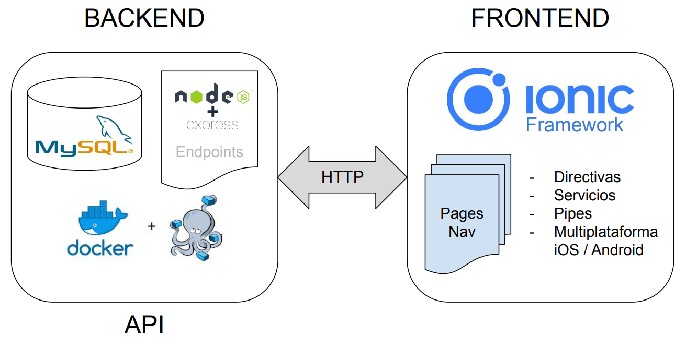

# TP-DAM-FINAL-Backend

## Descripción de la aplicación 

La aplicación a desarrollar es un sistema de riego el cual utiliza sensores ubicados en distintos puntos.
Estos sensores consisten en un medidor de vacío y un tubo sellado con una capa de cerámica porosa.
La capa de cerámica simula movimiento del agua a través del suelo. Mientras más seco se encuentra el suelo, más alta será la lectura del tensiómetro.
La interpretación de la lectura de un tensiómetro varía según el cultivo, el tipo de suelo y curva de humedad correlacionada. 
En función de la lectura obtenida se debera realizar el riego del cultivo mediante el accionamiento de una electroválvula.

### Estructura

La aplciación está compuesta por un Frontend y un Backend. El Frontend se encuentra dockerizado en un docker compose que contiene las imágenes por medio de la cuales se implementa la bases de datos MySQL y el entorno de ejecución de JavaScript NodeJS necesarios para la implementación de al API. 

El BackEnd esta desarrollado en Ionic Framework, con el fin de brindar un abuena experiencia al usuario y la posibilidad de su implementación multiplataforma.

La comunicación entre el Backend y Frontend se realiza por medio del protocolo HTTP utilzando los métodos GET y PUT.

   

